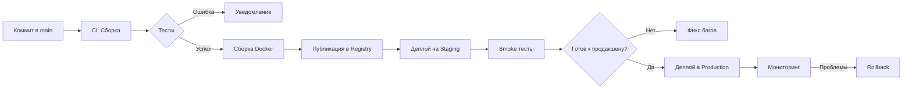

**CI/CD** (Continuous Integration / Continuous Delivery) — это набор практик и инструментов, которые автоматизируют процесс доставки программного обеспечения от этапа написания кода до развертывания в продакшене.

---

## 🔄 Что такое CI/CD?

### Простыми словами
Это **конвейер (pipeline)**, который автоматически:
1. Забирает ваш код из репозитория
2. Проверяет его (тесты, линтеры)
3. Собирает проект
4. Доставляет в нужное окружение

### Разделение понятий

| Термин | Значение | Что делает |
|--------|----------|------------|
| **CI** (Continuous Integration) | Непрерывная интеграция | Автоматически собирает и тестирует код при каждом изменении |
| **CD** (Continuous Delivery) | Непрерывная доставка | Автоматически готовит релиз к развертыванию |
| **CD** (Continuous Deployment) | Непрерывное развертывание | Автоматически развертывает в продакшен |

---

## 🏗️ Компоненты CI/CD

### 1. **Контроль версий (VCS)**
- Git (GitHub, GitLab, Bitbucket)
- Хранилище кода
- Триггер для запуска пайплайнов

### 2. **CI/CD сервер**
| Инструмент | Особенности |
|------------|-------------|
| **Jenkins** | Самый популярный, гибкий, много плагинов |
| **GitLab CI** | Встроен в GitLab, конфигурация в репозитории |
| **GitHub Actions** | Встроен в GitHub, удобен для open-source |
| **CircleCI** | Облачный, простой в настройке |
| **TeamCity** | Мощный, от JetBrains |
| **Travis CI** | Был популярен для open-source |

### 3. **Артефакты и репозитории**
- Docker Registry (Docker Hub, Amazon ECR)
- Nexus, Artifactory (для Java-артефактов)
- npm registry, PyPI

### 4. **Оркестрация и развертывание**
- Kubernetes
- Docker Swarm
- Ansible, Puppet, Chef
- Terraform

---

## 📋 Типовой CI/CD пайплайн

```yaml
# Пример .gitlab-ci.yml
stages:
  - build
  - test
  - deploy

variables:
  DOCKER_IMAGE: myapp:$CI_COMMIT_SHORT_SHA

build:
  stage: build
  script:
    - mvn clean package
    - docker build -t $DOCKER_IMAGE .
    - docker push $DOCKER_IMAGE
  artifacts:
    paths:
      - target/*.jar

test:
  stage: test
  script:
    - mvn test
    - mvn verify
  coverage: '/Total.*?([0-9]{1,3})%/'

deploy_staging:
  stage: deploy
  script:
    - kubectl set image deployment/myapp myapp=$DOCKER_IMAGE
    - kubectl rollout status deployment/myapp
  environment: staging
  only:
    - main

deploy_production:
  stage: deploy
  script:
    - kubectl set image deployment/myapp-prod myapp=$DOCKER_IMAGE
    - kubectl rollout status deployment/myapp-prod
  environment: production
  only:
    - tags
  when: manual  # Требует ручного подтверждения
```

---

## 🔨 Этапы CI/CD подробно

### Этап 1: **CI — Сборка и тестирование**

```bash
# Типичные шаги
1. git clone
2. Установка зависимостей
   npm install / mvn dependency:resolve / pip install -r requirements.txt
3. Линтеры и форматтеры
   eslint / checkstyle / flake8
4. Юнит-тесты
   npm test / mvn test / pytest
5. Сборка
   npm build / mvn package / docker build
6. Сохранение артефактов
   jar-файлы, Docker-образы, отчеты
```

### Этап 2: **Дополнительное тестирование**

```bash
# Интеграционные тесты
- Требуют БД, внешних сервисов
- docker-compose для поднятия зависимостей

# E2E тесты (end-to-end)
- Selenium, Cypress, Playwright
- Тестирование через браузер

# Тестирование безопасности
- SAST (Static Analysis) — SonarQube
- DAST (Dynamic Analysis) — OWASP ZAP
- Проверка зависимостей — Snyk, Dependabot
```

### Этап 3: **CD — Доставка и развертывание**

```bash
# Развертывание на staging
- Копирование артефактов на сервер
- Применение миграций БД
- Рестарт сервисов

# Приемочное тестирование (smoke tests)
- Проверка, что приложение запустилось
- Базовые сценарии

# Развертывание в production
- Blue-green deployment
- Canary releases
- Rollback при проблемах
```

---

## 🚀 Стратегии развертывания

### 1. **Rolling Update** (постепенное обновление)
```
Старая версия: [1][1][1][1][1]
Обновление:    [2][1][1][1][1]
               [2][2][1][1][1]
               [2][2][2][1][1]
               [2][2][2][2][1]
               [2][2][2][2][2]
```
✅ Нет downtime  
❌ Две версии работают одновременно

### 2. **Blue-Green Deployment**
```
Blue (старая):  [1][1][1][1][1]  ← активный
Green (новая):  [2][2][2][2][2]

Переключение: роутер перенаправляет трафик на Green
Green (новая):  [2][2][2][2][2]  ← активный
Blue (старая):  [1][1][1][1][1]  ← резерв
```
✅ Мгновенное переключение  
✅ Легкий откат (переключить обратно)  
❌ Нужно вдвое больше ресурсов

### 3. **Canary Release**
```
Сначала: [1][1][1][1][1]  (100% трафика)
Шаг 1:   [2][1][1][1][1]  (20% трафика на новую)
Шаг 2:   [2][2][1][1][1]  (40%)
Шаг 3:   [2][2][2][1][1]  (60%)
Шаг 4:   [2][2][2][2][1]  (80%)
Шаг 5:   [2][2][2][2][2]  (100%)
```
✅ Минимизация рисков  
✅ A/B тестирование  
❌ Сложнее в реализации

### 4. **Feature Toggles** (переключатели)
```java
if (featureFlags.isEnabled("new-payment")) {
    // новый код
} else {
    // старый код
}
```
✅ Включение фич без деплоя  
✅ Легкое A/B тестирование  
❌ Усложняет код

---

## 📊 Популярные инструменты

### CI/CD Серверы
| Инструмент | Конфигурация | Хостинг | Плюсы |
|------------|--------------|---------|-------|
| **Jenkins** | Jenkinsfile | Self-hosted | Гибкость, плагины |
| **GitLab CI** | .gitlab-ci.yml | Self/Cloud | Интеграция с GitLab |
| **GitHub Actions** | .github/workflows/*.yml | Cloud | Интеграция с GitHub |
| **CircleCI** | .circleci/config.yml | Cloud | Простота |
| **TeamCity** | UI + Kotlin DSL | Self-hosted | Мощный UI |

### Управление конфигурациями
- **Ansible** — YAML, без агентов, простой
- **Puppet** — свой язык, идемпотентность
- **Chef** — Ruby-подобный DSL
- **SaltStack** — быстрый, на Python

### Контейнеризация и оркестрация
- **Docker** — контейнеры
- **Kubernetes** — оркестрация контейнеров
- **Docker Compose** — локальная разработка

### Мониторинг и логи
- **Prometheus + Grafana** — метрики
- **ELK Stack** (Elasticsearch, Logstash, Kibana) — логи
- **Jaeger** — трейсинг

---

## 🛠️ Примеры конфигураций

### GitHub Actions
```yaml
# .github/workflows/ci.yml
name: CI Pipeline

on:
  push:
    branches: [ main, develop ]
  pull_request:
    branches: [ main ]

jobs:
  build:
    runs-on: ubuntu-latest
    
    steps:
    - uses: actions/checkout@v3
    
    - name: Set up JDK 17
      uses: actions/setup-java@v3
      with:
        java-version: '17'
        
    - name: Build with Maven
      run: mvn clean package
      
    - name: Run tests
      run: mvn test
      
    - name: Upload artifact
      uses: actions/upload-artifact@v3
      with:
        name: app-jar
        path: target/*.jar
```

### GitLab CI
```yaml
# .gitlab-ci.yml
image: maven:3.8-openjdk-17

cache:
  paths:
    - .m2/repository/

variables:
  MAVEN_OPTS: "-Dmaven.repo.local=$CI_PROJECT_DIR/.m2/repository"

before_script:
  - mvn --version

build:
  stage: build
  script:
    - mvn compile
  artifacts:
    paths:
      - target/classes/

test:
  stage: test
  script:
    - mvn test
  artifacts:
    reports:
      junit:
        - target/surefire-reports/TEST-*.xml
        - target/failsafe-reports/TEST-*.xml

deploy:
  stage: deploy
  script:
    - mvn deploy
  only:
    - main
```

### Jenkins Pipeline (Declarative)
```groovy
pipeline {
    agent any
    
    tools {
        maven 'Maven 3.8'
        jdk 'JDK 17'
    }
    
    stages {
        stage('Checkout') {
            steps {
                checkout scm
            }
        }
        
        stage('Build') {
            steps {
                sh 'mvn clean compile'
            }
        }
        
        stage('Test') {
            steps {
                sh 'mvn test'
            }
            post {
                always {
                    junit 'target/surefire-reports/*.xml'
                }
            }
        }
        
        stage('Package') {
            steps {
                sh 'mvn package'
            }
        }
        
        stage('Deploy to Staging') {
            when {
                branch 'main'
            }
            steps {
                sh './deploy.sh staging'
            }
        }
    }
    
    post {
        failure {
            emailext(
                to: 'team@example.com',
                subject: "Pipeline failed: ${env.JOB_NAME} - ${env.BUILD_NUMBER}",
                body: "Check console output at ${env.BUILD_URL}"
            )
        }
    }
}
```

---

## 🎯 Best Practices

### 1. **Маленькие, частые коммиты**
```bash
# Плохо: раз в неделю гигантский коммит
# Хорошо: несколько коммитов в день, каждый с маленьким изменением
```

### 2. **Не ломайте main**
- Ветка main всегда должна быть зеленой (проходить все тесты)
- Feature-ветки проверяются перед merge

### 3. **Быстрые пайплайны**
- Медленный CI → разработчики перестанут его ждать
- Параллельное выполнение
- Кэширование зависимостей

### 4. **Один шаг — одна ответственность**
```
❌ Плохо: один шаг "build_and_deploy"
✅ Хорошо: build → test → package → deploy
```

### 5. **Идемпотентность**
- Повторный запуск пайплайна должен давать тот же результат
- Не полагайтесь на "состояние" окружения

### 6. **Безопасность**
- Не храните секреты в коде!
- Используйте встроенные механизмы (GitHub Secrets, GitLab CI variables)
- Сканируйте зависимости на уязвимости

### 7. **Версионирование артефактов**
```bash
# Используйте commit hash или build number
myapp:1.2.3
myapp:1.2.3-b123
myapp:abc123def  # commit hash
```

---

## 📈 Метрики CI/CD

Что отслеживать:

| Метрика | Что показывает | Хорошее значение |
|---------|----------------|------------------|
| **Время сборки** | Как быстро CI | < 10 минут |
| **Частота деплоев** | Как часто релизим | Чем чаще, тем лучше |
| **Процент успешных сборок** | Стабильность | > 95% |
| **MTTR (время восстановления)** | Как быстро чиним | < 1 часа |
| **Change Failure Rate** | Сколько деплоев ломается | < 15% |

---

## 🔧 Проблемы и решения

### Проблема: Медленные тесты
**Решение:**
- Параллельное выполнение
- Только критичные тесты в CI, остальные ночью
- Тесты, специфичные для измененных модулей

### Проблема: Флаки-тесты (нестабильные)
**Решение:**
- Перезапуск упавших тестов (1-2 раза)
- Изоляция флаки-тестов в отдельную стадию
- Срочное исправление или удаление

### Проблема: Конфликты при merge
**Решение:**
- Частый rebase от main
- Автоматическое тестирование merge-результата

### Проблема: Утечки памяти в долгих пайплайнах
**Решение:**
- Ограничение ресурсов
- Автоматическая очистка
- Рестарт агентов после каждого билда

---

## 🚀 Пример: Полный цикл от коммита до продакшена



---

## 📚 Резюме

| Что нужно | Чем делать |
|-----------|------------|
| Хранить код | Git (GitHub, GitLab) |
| Автоматизировать сборку/тесты | CI сервер (Jenkins, GitHub Actions) |
| Управлять конфигурацией | Ansible, Kubernetes |
| Мониторить | Prometheus, Grafana |
| Смотреть логи | ELK, Loki |
| Отслеживать ошибки | Sentry, Bugsnag |

**Главное:** CI/CD — это не про инструменты, а про **культуру**. Культуру автоматизации, тестирования и быстрой обратной связи.